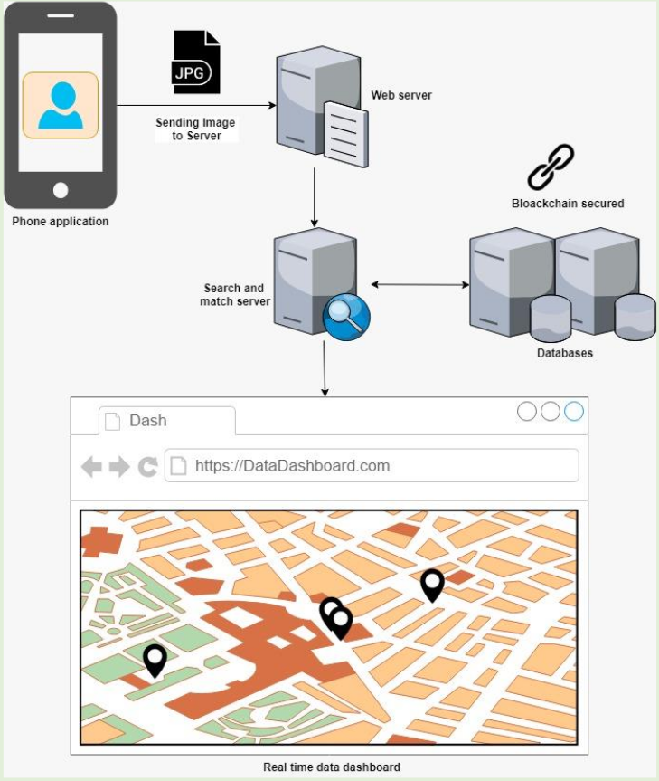
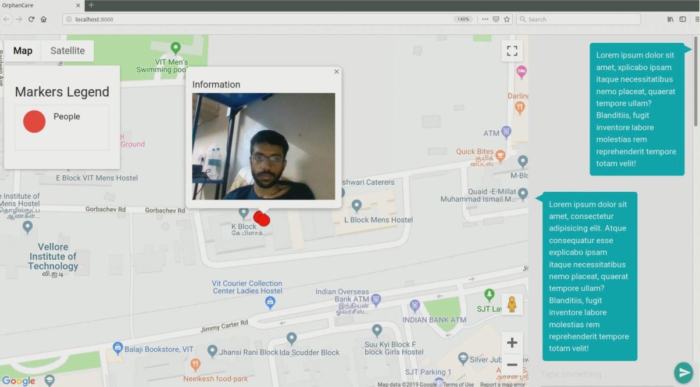
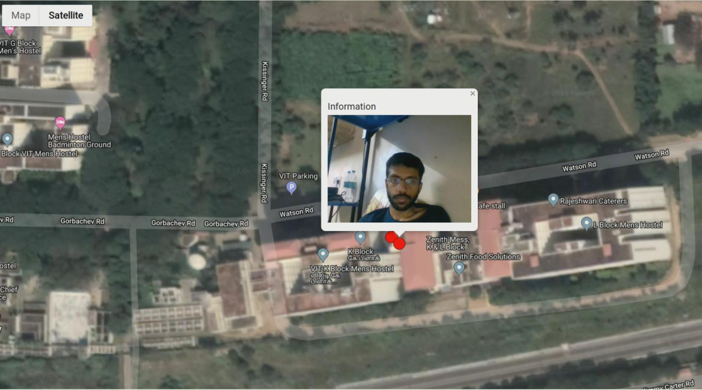
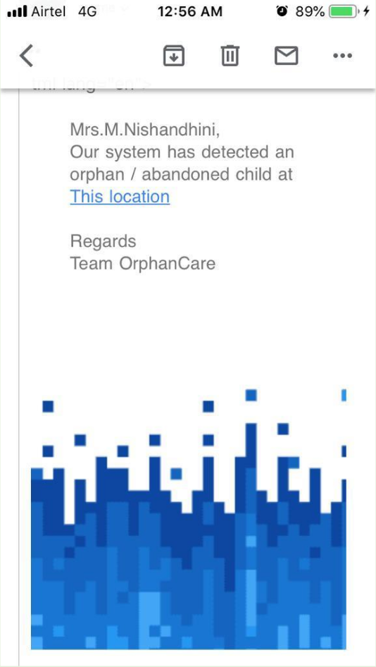

# OrphanCare

### Problem statement

India, with its growing population, is experiencing a growing no. of children who are left unattended in the streets for various reasons. There is extreme difficulty is mapping those in need and to rescue them from the streets. We wanted to solve this problem by using blockchain and face recognition empower the public with a platform to fight child mistreatments and child abuse.

### Objectives

 - [x] Using blockchain and face recognition empower the public with a platform to fight child mistreatments and child abuse.
 - [x] Provide a platform for NGOs that target rehabilitation of unattended street children/orphans
 - [x] Empower any user to help eradicate a gloomy future for these kids
 - [x] Make it cross-platform so as to ensure maximum usage and no restrictions

## Architecture

The proposed design is an Progressive Web App that runs on all platforms irrespective of Operating Systems. The application allows the user to take a geotagged image which delivered to a web server which again forwards it to a search and match server which functions as a matcher. The search and match servers run facial recognition algorithms and checks from the database for image data matching to anything in the database. If a match is found, the concerned organisation can view the geotagged image and the location of the child found. The organisation can take further action accordingly.

   
  <i><b>Figure:</b> Application architecture</i>

### PWA Setup

1. [Web page URL](https://orphancare.netlify.com)
2. User gets a prompt to add the web page to home screen.
3. If selected, converts the web page to an application and saves it locally on device.

### Application usage

1. Simple and easy to use interface.
2. Directly opens camera and allows user to take an image.
3. Sending the image and geo location to the server.
4. Incase of internet access, the image and location data is sent to the server immediately for further processing.
5. Incase the device does not have access to the internet as of now, the image is stored. As soon as the device connects to the internet, the stored images and location data are relayed to the server.

### Dashboard setup
1. The dashboard provided the concerned organizations with real time data about the application usage.
2. As soon as an image is relayed to the server, the information retrieved from the image is stored in Firebase Cloud datastore.
3. This real time database, is what drives the dashboard. The data send to the database, is displayed in real time to the users.
4. The dashboard consists of a ma layout to present the location data.
5. Each marker is interactive and provides the user with the image data from the particular location.
6. The dashboard can also integrate a chat interface that will allow for easy communication between the parties.

   
  <i><b>Figure:</b> Dashboard - Organization level overview</i>

### Server code

1. The server is the brain of the system. It links the consumer to the organizations and handles all the processing.
2. On receiving an image, the server first runs face detection and face recognition algorithms.
3. This is used to try and identify the person from the image.
4. The image and location data is stored in the datastore.
5. This information is also secured using a blockchain architecture that provides security for this sensitive data.

  
  
   
  <i><b>Figure:</b> Email notification with location</i>

## Contributors

 - [@apuayush](https://github.com/apuayush)
 - [@nishnash54](https://github.com/nishnash54)
 - [@SuryaThiru](https://github.com/SuryaThiru)
 - [@samyak-jain](https://github.com/samyak-jain)
 - [@technophilic](https://github.com/technophilic)